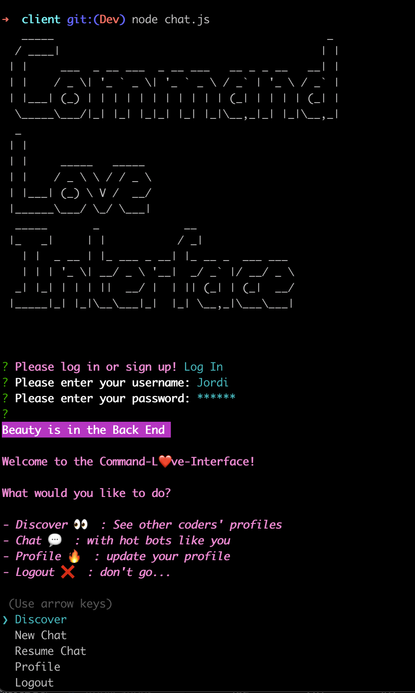
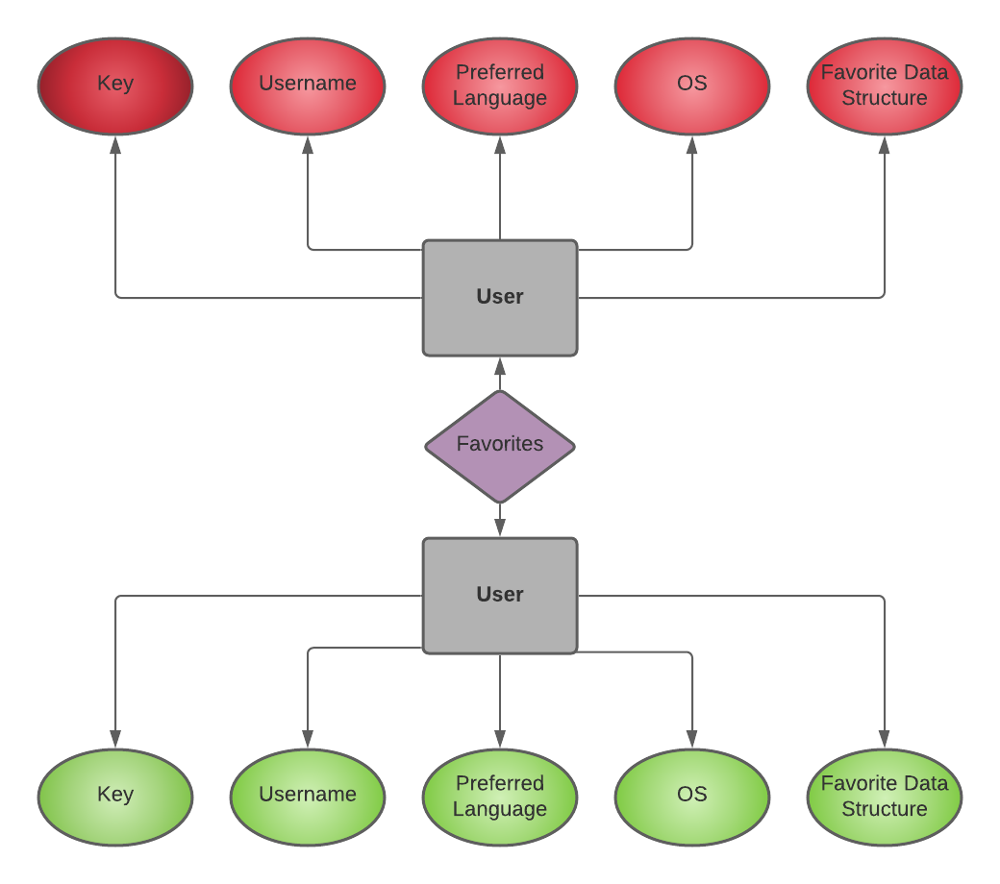

# Command Love Interface

## Setup

- Clone down this repo locally
- cd into `client` folder
- turn on `chat.js` using `node chat.js`
- login or sign up to use the app

## Async and the Awaits

Code401 Midterm Project

### Members

- Lulu Sevignon
- Alex Whan
- Joshua Beasley
- Stephen Baldock

**Project Name: Command Love Interface**

Server deployed on Heroku: [command-love-interface.herokuapp.com](https://command-love-interface.herokuapp.com/)

## Project Proposal

For lonely, overworked developers who suffer from increasing social paralysis and the impact of COVID-19. Meet the love of your life without leaving the terminal with the dating app for backend developers. Connect about your common languages, learn all of the great features of ES6, and enjoy unlimited messages for a low, low monthly subscription.

### User Stories

- Guillermo is a 24 year old software developer from Cupertino, California. When he's not writing software for a small startup, he's researching how to write software for the small startup. With so little spare time, Guillermo desires to connect with someone who shares a common interest in back-end design and a similarly imbalanced work to leisure ratio.
  As an overworked software developer, Guillermo is seeking a convenient way to connect with potential partners without having to disrupt his life in a significant way.

- As a user, I'm bored of the same old terminal interface and desire the aesthetics of traditional front-end applications while interacting on the back-end.

- As a user, I want to be able to receive any messages or communications that came in while offline, so that I am able to log in/out of the app at leisure without worrying about missing anything.

- As a user, I want to be able to save chat partners somewhere so I can place the conversation on hold and pick it back up at a later time.
  - Acceptance Test - Ensure that "saved" chat partners are saving in a database and can be added, deleted, or updated.
- As a user I want to express myself by inviting potential partners to solve the code challenge I developed.

- As a developer, I want users to be able to store their personal information in a profile, and to store this information safely and securely.

- As a user, I want to be able to use a personal login to retrieve my communication sessions with other users, and to have basic authentication associated with my personal profile in order to protect my personal information.

- As a user I'm unsure of what to talk about, So let's talk about your code solution!

### PM Tools

- Trello will act as the team project management hub to maintain
  organization of daily tasks, measure progress toward MVP, and
  document individual work loads
  - [Trello](https://trello.com/b/p7RLAdR7/team-beasley)
- GitHub will server as a central repository for all working code and completed steps

### Technologies
- JavaScript
- Node.js
- Socket.io
- MongoDB Atlas
- Heroku

### Style 
- Chalk
- Figlet
- Node Emoji

### Conflict Plan

- Applicable Scenarios:
  - Team member refusing to participate
  - Team member minimizing other team member contributions
  - Team member communicating in a rude or inappropriate way
  - Argument between two or more team members
- Solutions:
  - Open communication and be up front if you’re struggling or having trouble with something
  - If it feels like someone is not pulling their weight, have a stand up or group discussion to assess the situation and what everyone is working on (and has worked on so far)
  - Commit to fixing the situation moving forward
  - Possible redistribution of working moving forward, etc
  - Two people getting into a real argument/emotions running high (people disagreeing on how to build a feature, etc):
  - Everyone take a break for a few minutes to collect their thoughts
  - Ask others in the group to listen and mediate, and if that’s not possible, go to JB or the TAs as an outside perspective
  - Helpful mindset in terms of approaching other teammates with constructive criticism and productive solutions for fixing processes moving forward

### Communication Plan

- Primary communication tools: Remo & Slack
  - Zoom to act as backup if Remo experiences functionality issues
  - Zoom to provide additional pair-programming platform due to superior screen
- Phone numbers as last resort/backup
- Working hours: 9:00am-6:00pm, Monday-Friday
- Daily Team standup (separate from standup with JB) at 9am
  - Mention features you are working on after hours, so there’s less chance of a merge contract
  - Standup meetings are a good place for everyone to communicate issues they may be having, topics they would like to address, and generally making sure that everyone is feeling safe creatively and psychologically Check in with everyone regarding their working plans for the day, can organize pair programming as needed

## Entity Relationship Diagram

